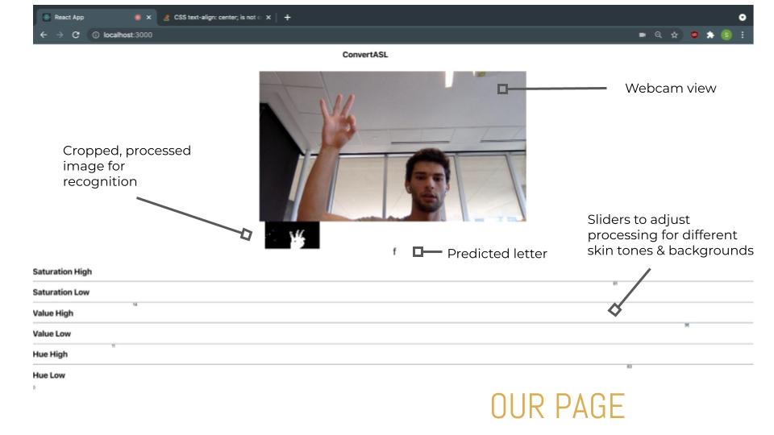

# ConvertASL

A real time ASL-to-Text converter made in 24 hours for the HackCMU 2021 Hackathon.

## Table of Contents

- [Inspiration](#inspiration)
- [What it does](#what-it-does)
- [How we built it](#how-we-built-it)
- [Technologies used](#technologies-used)
- [Challenges](#challenges-we-ran-into)
- [Accomplishments](#accomplishments-we-are-proud-of)
- [What we learned](#what-we-learned)
- [What's next](#what-is-next-for-convertasl)

## Inspiration

Approximately 250,000-500,000 people use ASL in the United States and Canada. However, with the global pandemic, Zoom and other video communication mediums cause an issue: signing is much faster than typing, but there is no automatic ASL translation available. Our project aims to provide a solution to this issue.

## What it does

This project is a webpage that interprets ASL using machine learning and computer vision.

## How we built it

We used a model trained on a Kaggle dataset, configured it to match our Tensorflow JS format, then stored it in an IBM cloud bucket to host it on the cloud. We then load in our model to a React.js frontend, where we do image normalization from the webcam and run the model for real time ASL gesture classification.

## Technologies used

- Tensorflow & tf.js
- React.js
- IBM Cloud
- Keras

## Challenges we ran into

We ran into difficulties configuring models to work correctly and getting our classification to work correctly with different image qualities and sizes.

## Accomplishments we are proud of

Converting models and figuring out the general pipeline was a major step for us, along with figuring out HSV cutoffs to allow for recognition with different skin tones and lighting conditions.

## What we learned

We learned about React.js, IBM cloud hosting, and configuring Tensorflow.

## What is next for ConvertASL

We hope to make our interpretations more accurate, then allow for chaining of multiple letters to make a longer block of text. We would also like to integrate this with Zoom, Discord, or other major video communication platforms.
